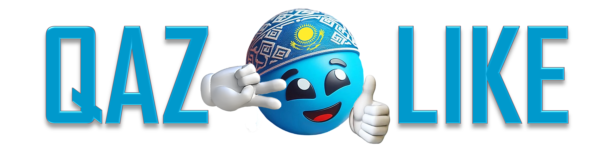

# QazLike - Technological Democracy (Democracy 2.0)

## 📜 Manifesto Documentation

### 🔗 Quick Links:
- **[📖 FULL MANIFESTO (English)](QAZLIKE_eng.docx)** - Complete Technological Democracy concept
- **[📊 Development Plan](QazLike_Нейтральный_Обсуждение.docx)** - Technical implementation roadmap
- **[⚖️ License](LICENSE)** - Creative Commons BY-NC-SA 4.0

## 🎯 Core Concept

**QazLike** represents the evolution of democracy through technology - blockchain, AI, and smart contracts enabling direct citizen participation in governance. Every citizen becomes a shareholder of the country with control over 100% of national budget distribution.

## 🌟 Key Principles

- **Participatory Budgeting 2.0** - 100% direct distribution to citizens
- **Three-Tier Governance** - Security → Development → Personal Freedom
- **Competitive Government Formation** - Performance-based leadership
- **Digital Constitution** - Living, evolving fundamental law
- **Fair Wealth Distribution** - Citizens as national shareholders

## 🚀 Implementation Stages

1. **MVP** - Budget Simulator
2. **Public App** - Real budget data integration  
3. **PRO Version** - Municipal budgets
4. **Investment Module** - Crowdinvesting platform
5. **Global Version** - International adaptation

## 📄 License

**© 2025 Roman Arystanov**  
This work is licensed under Creative Commons Attribution-NonCommercial-ShareAlike 4.0 International

---

**Join the movement for Technological Democracy!**  
*The future begins now. And that future is QazLike.*
